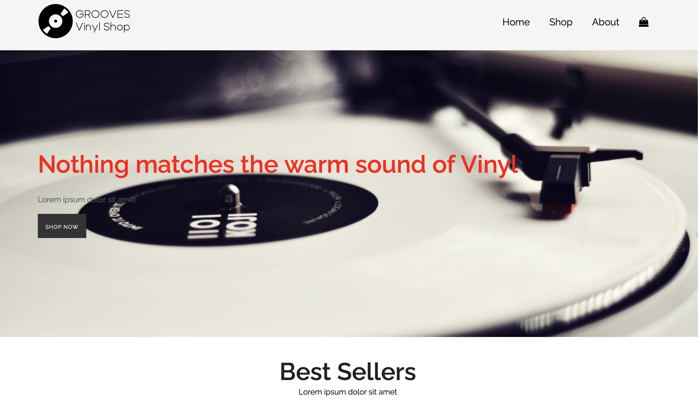
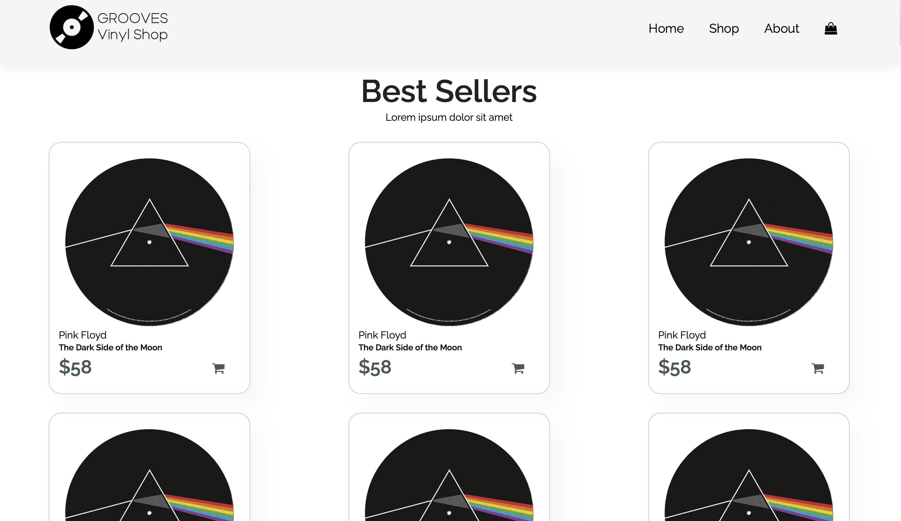
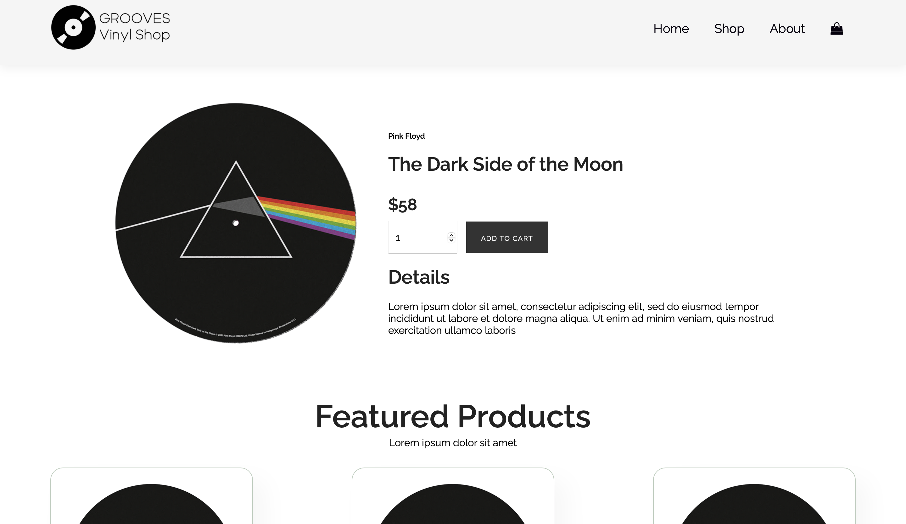
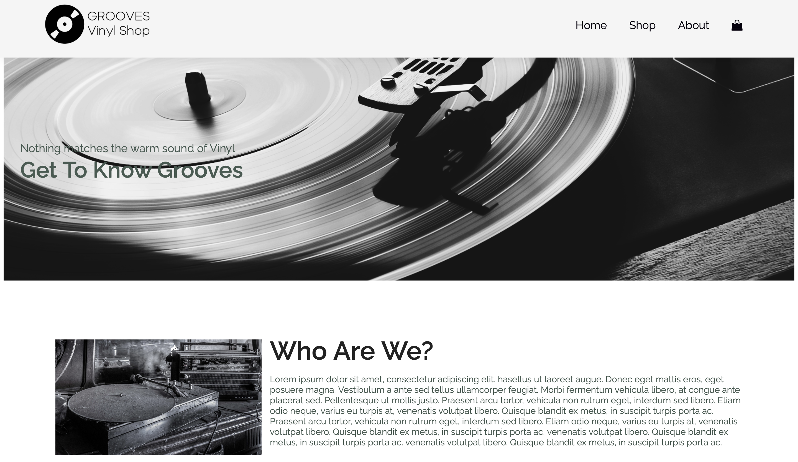
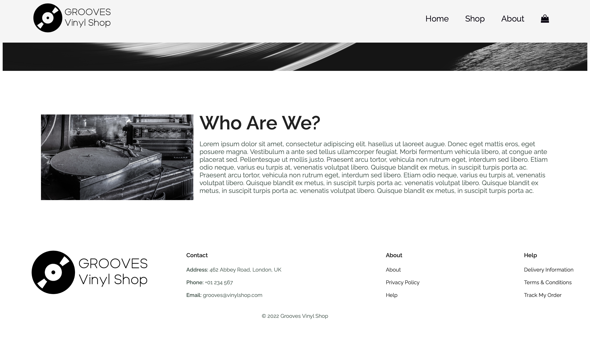
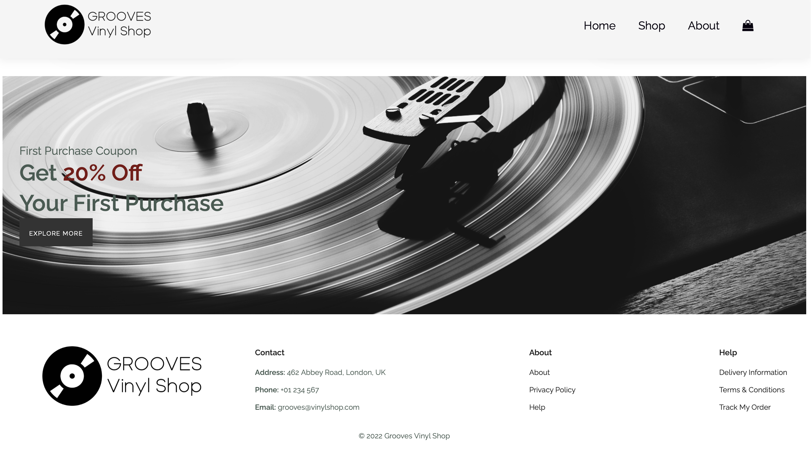

# Grooves Shop

Welcome to the Grooves Vinyl Shop repository! This project showcases a vinyl shop webpage.  

## Table of Contents 
- [Overview](#overview)
- [Screenshots](#screenshots)
- [Features](#features) 
- [Technologies](#technologies) 
- [Setup](#setup) 
- [Contributing](#contributing)

  ## Overview 

Get to know what vinyl is all about.
Grooves Vinyl Shop is a stylish and modern web application that offers a user-friendly platform to browse and purchase vinyl records. 

## Screenshots  

### Home Page 

 



### Product Page 



### About Us Page




### Discount Banner 



## Features 

- Browse vinyl records
- View details of each vinyl record 
- Add vinyl records to the shopping cart 
- User-friendly interface  
- Landing Page 
- Get to know more about the shop
  
## Technologies 

- HTML5 
- CSS3 
- JavaScript 

  ## Setup 
  To run this project locally, follow these steps:  
  
1. Clone the repository   

```
git clone https://github.com/TheDude-creator/GroovesShop.git
```

2. Navigate to the project directory

``` 
cd GroovesShop
```

3. Open `index.html` in your browser to view the webpage


## Contributing

Contributions are welcome! If you'd like to contribute, please follow these steps:

1. Fork the repository. Create your feature branch (git checkout -b feature/YourFeature).
2. Commit your changes (git commit -m 'Add some feature').
3. Push to the branch (git push origin feature/YourFeature).
4. Open a pull request.
